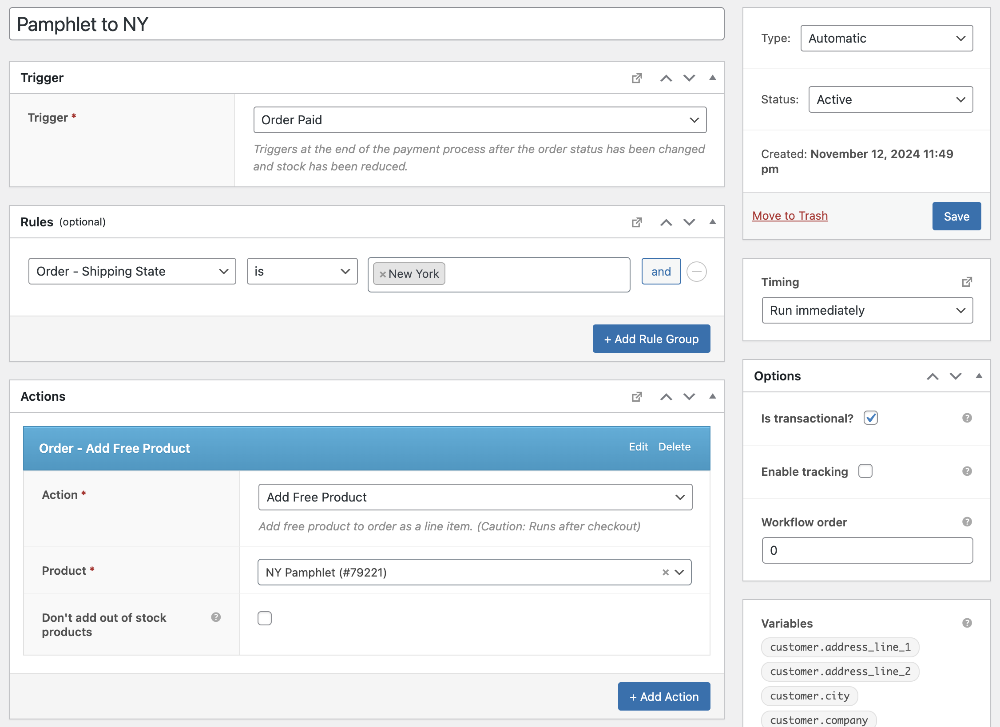

| :exclamation:  This is a public repository |
|--------------------------------------------|

# AutomateWoo Order Rule - Shipping State
Adds a custom AutomateWoo rule to check the shipping state on order.

## Usage

Input the state or states that you want to compare against. If the order shipping state matches one of the selected states, the rule will evaluate to true.

## Support

This plugin is provided without any support or guarantees of functionality. If you'd like to contribute, feel free to open a PR on this repo. Please test thoroughly before deploying to a production site.
